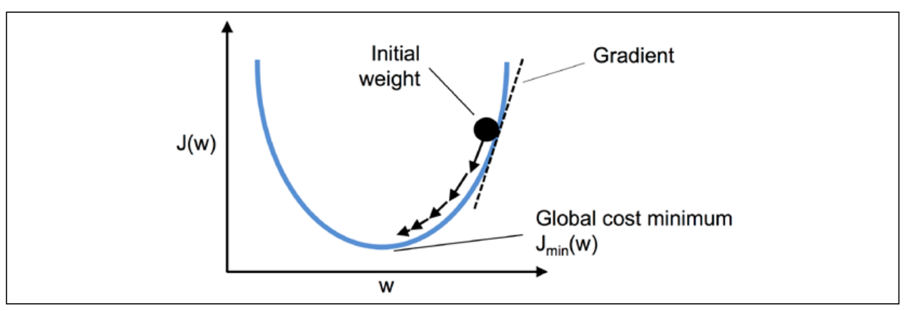

[`Computación Flexible`](../README.md) > `Unidad 2. Adaline`

## Unidad 2. Adaline

### Objetivo

En esta clase el alumno conocerá:

* La estructura básica de Adaline. 
* Las funciones de error utilizadas en Adaline. 
* La regla del Gradientes Descendente y Gradientes Descendente Estocástico.
* Estrategia de ajuste de pesos online y banco 
* La estructura básica de Madaline

### 1. Estructura básica de Adaline

* 1943 - McCullock & Pitts (MCP) describen un célula nerviosa como una simple compuerta lógica nerviosa con salidas binarias.
* 1957 - Frank Rosenblantt publicó el primer concepto de las reglas de aprendizaje del perceptrón basado en el modelo neuronal de MCP.
* En 1959, Adaline (ADAptative Linear NEuron) fue publicada por Bernard Widrow, como un mejora del Perceptron de Rosenblatt.

**¿Cuál es la diferencia entre Perceptron y Adaline?**

*¿Qué tienen en común?*

* Son clasificadores binarios.
* Ambos usan un limite de decisión lineal.
* Ambos aprenden de manera iterativa, ejemplo por ejemplo ( el Perceptron de manera natural y Adaline utiliza el Gradiente Descendente Estocástico).
* Ambos usan una función de umbral.
* Ambos algoritmos calculan la salida ($z$) mediante la combinación lineal de las características (variables $x$) y los pesos del modelo ($w$).

    $z= w_0x_0 + w_1x_1+ \ldots+w_m x_m = w^Tx$
* En el Perceptron y en Adaline, se define una función umbral para realizar una predicción. Por ejemplo, si $z$ es mayor que el umbral $\theta$. Se predice la clase 1, y la clase 0 en el caso contrario.

*Las diferencias.*

* El Perceptron **utiliza las etiquetas** de las clases para aprender los coeficientes del modelo.
* Adaline **utiliza valores de predicción continuos** para aprender los coeficientes del modelo.

La diferencia de Adaline y el perceptrón es la regla de aprendizaje (Widrow-Hoff rule). Los pesos son actualizados en una función de activación lineal en lugar de la función de unidad paso como en el Perceptrón. En Adaline, la función de activación lineal $\phi (z)$es simplemente la función identidad de la salida de la red, así que: $\phi(w^Tx) = w^Tx$

### 2. Función de error

Un punto clave de los algoritmos de ML es la definición de la función de costo que es optimizada durante el proceso de aprendizaje. 
La función objetivo es frecuentemente la función de costo que se desea minimizar. En esta caso de Adaline, la función de costo es la suma de los errores cuadrados (SSE, Sum of Square Errors) entre la entrada actual calculada y la etiqueta de clase correcta:

$J(w) = \frac{1}{2} \Sigma_i (y^{(i)}-\phi(z^{(i)}))^2$

### 3. Gradiente y búsquedas de máximos y mínimos

La idea del gradiente descendiente (climbing down a hill) hasta alcanzar el mínimo costo local o global. En cada iteración, se toma un paso en sentido opuesto del gradiente, el tamaño del paso es determinado por el valor de la taza de aprendizaje, así com la pendiente del gradiente:

Usando el gradiente descendente, se pueden actualizar los pesos con un paso en la dirección opuesta del gradiente $\triangledown J(w)$, de la función de costo, $J(w)$:

$w := w + \Delta w$

El cambio de pesos $\Delta w$, es definido como el gradiente negativo multiplicado por la taza de aprendizaje, $\eta$:

$\Delta w= -\eta \triangledown J(w)$

Para calcular el gradiente de la función de costo, necesitamos calcular la derivada parcial de la función de costo con respecto a cada peso $w_j$:

$\frac{\partial J}{\partial w_j} = - \Sigma_i (y^{(i)} - \phi(z^{(i)}))x_j^{(i)}$

Así que se puede calcular la actualización de los pesos $w_j$  como:

$\Delta w_j = - \eta \frac{\partial J}{ \partial w_j} = \eta \Sigma_i (y^{(i)} - \phi(z^{(i)}))x_j^{(i)}$

Como actualizamos los pesos de manera simultánea, la regla de aprendizaje de Adaline :

$w:= w + \Delta w$

### 4. Ajuste de pesos Adaline

A pesar de que la regla de aprendizaje de Adaline se ve idéntica a la regla del Perceptrón,  debemos notar que $\phi (z^{(i)})$  con $z^{(i)} = w^Tx^{(i)}$ es un número real y no un entero como en la etiqueta de la clase. Además, la actualización de pesos se calcula a partir de todos los ejemplos de la muestra de entrenamiento (en lugar de actualizar los pesos para cada ejemplo de entrenamiento), por lo cual este enfoque es llamado como **Batch Gradiente Descendente**.

Algoritmo de entrenamiento

1. Inicializar los pesos
2. Calcular la entrada a la neurona

    $z= w_0x_0 + w_1x_1+ \ldots+w_m x_m = w^Tx$

3. Calcular la salida con la función de activación identidad

    $\phi(z)= z$

4. Actualizar los pesos

    $w := w + \Delta w$

    $\Delta w_j =  \eta \Sigma_i (y^{(i)} - \phi(z^{(i)}))x_j^{(i)}$

5. Repetir los pasos 2 al 4 hasta que las salidas reales y las deseables sean iguales para todos los vectores del conjunto de entrenamiento.

---
**Ejemplo de entrenamiento de Adaline**

Considerar la compuerta lógica AND:

| No. |Entradas  |  Salidas  |
|-----|----------|-----------|
|1    |( 1,   1) |    1      |
|2    |( 1,   0) |    0      |
|3    |( 0,   1) |    0      |
|4    |( 0,   0) |    0      |

Realizar las primeras dos épocas de entrenamiento de Adaline considerando los pesos iniciales: $ w_b = -0.6,  w_1=0.3, w_2= 0.2$, con una taza de aprendizaje $\eta = 0.5$.

---

* [`Ejemplo de aprendizaje de Adaline`](./code/Ejemplo%20Adaline.ipynb)

El gradiente descendente (GD) es uno de los algoritmos que se benefician con el escalado de características. Un método para el escalado de características es la estandarización. Este escalado da a los datos las propiedades de una distribución normal estándar: media cero y varianza unitaria. Este proceso de normalización ayuda al GD a converger más rápidamente. Sin embargo, no hace que la muestra de datos original se distribuya normalmente. La normalización desplaza la media de cada característica para que se centre en cero y cada característica tenga una desviación estándar de 1 (varianza unitaria). Por ejemplo, para estandarizar la n-ésima característica, podemos simplemente restar la media de la muestra, $\mu_j$, de cada ejemplo de entrenamiento y dividirla por su desviación estándar  $\sigma_j$:

$x'_j = \frac{x_j - \mu_j}{\sigma_j}$

* [`Práctica de Adaline GD`](./code/AdalineGD.ipynb)

**Gradiente Descendente Estocástico.**

El proceso de minimizar la función de costo al dar un paso en la dirección opuesta del costo del gradiente que es calculado a partir de toda la muestra de entrenamiento, es referido como **gradiente descendente en batch**. Si se tiene un conjunto de datos con millones de ejemplos, utilizar el aprendizaje en batch puede resultar costo en términos computacionales. Sobre todo sí tenemos que re-evaluar toda la muestra de entrenamiento cada vez que se da un paso hacia el mínimo global.

Una alternativa común al algoritmo del gradiente descendente en batch es el algoritmo de **Gradiente Descendente Estocástico (SGD, Stochastic Gradient Descent)**, el cual es llamado también **iterativo**  o gradiente descendente **online**. En lugar de actualizar los pesos basado en la suma de los errores acumulados sobre toda la muestra de entrenamiento, $x^{(i)}$:

$\Delta w_j =  \eta \Sigma_i (y^{(i)} - \phi(z^{(i)}))x_j^{(i)}$

se actualizan los pesos incrementalmente para cada una de las muestras del conjunto de entrenamiento:

 $\eta (y^{(i)} - \phi(z^{(i)}))x_j^{(i)}$

A pesar de que SGD puede ser considerado como una  aproximación del gradiente descendente, alcanza la convergencia normalmente más rápido por la mayor frecuencia de actualización de pesos. Dado que cada gradiente es calculado con base en un solo ejemplo de entrenamiento, la superficie de error es más ruidosa que en gradiente descendente, lo cual puede tener la ventaja que SGD puede escapar de un mínimo local plano mucho más fácilmente si trabajamos con funciones de costo no lineales. Para obtener resultados satisfactorios vía SGD es muy importante presentar los datos en un orden aleatorio, también, cambiaremos el orden de los datos de entrenamiento para cada época para prevenir ciclos.

Otra ventaja de SGD es que podemos usarla para un entrenamiento online. en este entrenamiento, el modelo entrena al momento de que llegan nuevos datos de entrenamiento. Esto es especialmente práctico si se cuenta con muchos datos, por ejemplo, datos de clientes de una aplicación web, Usando aprendizaje online, el sistema puede inmediatamente adaptarse a los cambios, y los datos de entrenamiento pueden ser descartados después de actualizar el modelo si el espacio de memoria es un cuestión.

* [`Práctica de Adaline SDG`](./code/AdalineSGD.ipynb)

### 5. Estructura básica de Madaline

En 1959, Widrow & Hoff desarrollaron el model **Adaline** (ADAptative LINear Element) y Madaline (Multiple ADAptative LINear Element).

Después de la publicación de la regla del Perceptrón y el algoritmos LMS (Regla Delta de Widrow-Hoff), en las próximas décadas nuevas técnicas has sido desarrolladas en el campo de las RNAs. Uno de los primeros desarrollos fue el aprendizaje de matrices de Steinbuch, una máquina de reconocimiento de patrones basada en funciones lineales discriminatorias. Al mismo tiempo Widrow y sus estudiantes planeaban **Madaline Rule I (MRI)**, la primera regla de aprendizaje para RNAs con múltiples elementos adaptativos (múltiples neuronas Adaline).

En 1987, Widrow y Winter desarrollaron una nueva técnica basada en MRI que pudiera adoptar multiples capas de elementos adaptativos con el uso de limitadores de cuantificación, el resultado fue **Madaline Rule II**. 

En el año de 1988, David Andes desarrolló wy**Madaline Rule III** que modificó a Madaline II mediante el reemplazo de los limitadores de cuantificación en Adaline con funciones sigmodeas. Widrow y sus estudiantes fueron los primeros en reconocer que esta regla era matemáticamente equivalente a backpropagation.

### 6. Reglas de entrenamiento de Madaline

Madaline consta de una capa de Adalines y una función de mayoría cuya respuesta binaria depende de las repuestas de las Adalines.

El algoritmo de entrenamiento es el siguiente:

1. Inicializar los pesos
2. Para cada Madaline
    1. Para  cada ejemplo de entrenamiento, $x^{(i)}$
    2. Calcular la salida, $\hat y$
    3. Determinar la salida ca
3. Determinar la salida del Madaline $M(t)=F_{mayoría}(y_k(t))$
4. Determinar el error y actualizar los pesos
    1. Si $M(t)=$  salida deseada, entonces no se actualiza, de otro modo los elementos Adaline compiten y se actualiza el ganador, es decir al Adaline con salida errónea más cercana a cero en su salida original (y)

5. Repetir los pasos del 2 al 4 hasta que las salidas reales y las deseadas sean iguales para todos los vectores del conjunto de entrenamiento.

### 7. Modelado de funciones booleanas

[`Anterior`](../README.md) | [`Siguiente`](../L03-perceptron/README.md)
