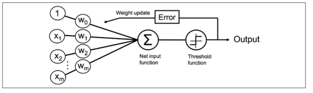
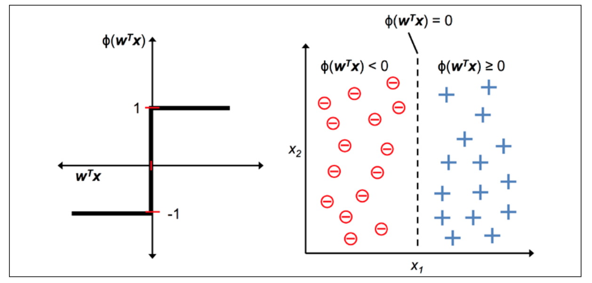
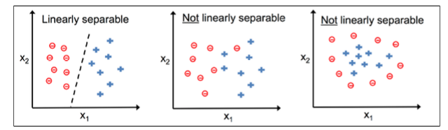

[`Computación Flexible`](../README.md) > `Unidad 3. Perceptrón`

## Unidad 3. Perceptrón

### Objetivo

En esta clase el alumno conocerá:

* La estructura básica del perceptrón.
* Las funciones de activación que pueden ser utilizadas en una neurona.
* La regla para realizar el ajuste de los pesos.
* El problema relacionado con la representación del límite de decisión del perceptrón.

### 1. Estructura básica

* 1943 - McCullock & Pitts (MCP) describen un célula nerviosa como una simple compuerta lógica nerviosa con salidas binarias.

* 1957 - Frank Rosenblantt publicó el primer concepto de las reglas de aprendizaje del perceptrón basado en el modelo neuronal de MCP.


<div style="text-align: justify;">

De manera formal podemos exponer ester problema como una tarea de clasificación binaria donde nos referimos a nuestras dos clases como 1(clase positiva) y -1 (la clase negativa) por simplicidad. Podemos definir la función de activación $\varphi(z)$ que toma la combinación lineal de ciertos valores de entrada $x$ y un correspondiente vector de pesos $w$, donde $z$ es llamada la salida de la red $z=w_1x_1 + \ldots + w_mx_m$

```math
w = \begin{bmatrix} w_1 \\ \vdots \\ w_m
\end{bmatrix}

w = \begin{bmatrix} w_1 \\ \vdots \\ w_m
\end{bmatrix}, x = \begin{bmatrix} x_1 \\ \vdots \\ x_m
\end{bmatrix}
```


### 2. Fuciones de activación

Ahora, si la salida de activación de un ejemplo en particular $x^{(i)}$, es decir, que si la salida de $\varphi(z)$, es mayor que el umbral definido $\theta$, se puede predecir como un ejemplo de la clase 1 y en caso contrario de la clase -1. En el algoritmo del perceptrón, la función de activación $\varphi(\cdot)$ es una simple función de paso de unidad, la cual algunas veces es llamada función de paso Heaviside:

```math
\varphi(z)= 
\left\{ 
\begin{matrix} 
1 & \text{si }v \geq \theta \\
0  & \text{en otro caso }
\end{matrix} 
\right.
```

o

```math
\varphi(v)=
\left\{
\begin{matrix} 
1 & \text{si }v \geq \theta \\
-1 & \text{en otro caso}
\end{matrix} \right.
```

Por simplicidad, podemos traer el umbral $\theta$ al lado izquierdo de la ecuación y definir a peso-cero como $w_0 = -\theta$ y $x_0= 1$, por lo tanto escribimos $z$ en una forma más compacta desde:

$z= w_0x_0 + w_1x_1+ \ldots+w_m x_m = w^Tx$  

y

```math
\varphi(v)= \left \{ \begin{matrix} 
1 & \text{si }v \geq 0 \\ -1 & \text{en otro caso}
\end{matrix} \right.
```

En la siguiente figura se ilustra como la salida de la red $z=w^T x$ es reducida a una salida binaria (-1 o 1) por la función de activación del perceptrón y cómo puede ser usada para descriminar entre dos clases linealmente separables:




### 3. Ajuste de pesos por Descenso Escalonado

La idea completa detrás de la neurona MCP y el modelo del perceptrón con umbral de Rosenblantt es usar un enfoque de reducción para imitar como una sola neurona del cerebro funciona: si esta se activa o no. Por lo tanto, la regla inicial del perceptrón de Rosemblantt is justamente muy simple, y el algoritmo del perceptrón puede ser resumido en los siguientes pasos:

1. Inicializar los pesos a 0 o un valor random pequeño.  
2. Para cada ejemplo del entrenamiento, $x^{(i)}$:
    1. Calcular el valor de salida, $\hat{y}$
    2. Actualizar los pesos

El valor de salida es la etiqueta de clase precedida por la función de paso de unidad que definimos previamente y la actualización simultánea de cada peso, $w_j$, en el vector de pesos $w$ puede ser formalmente escrito como:

$w_j= w_j + \Delta w_j$

El valor de actualización para $w_j$, el cual nos referimos como $\Delta w_j$, es calculado por la regla de aprendizaje del perceptrón como:

$\Delta w_j = \eta(y^{(i)} - \hat{y}^{(i)})$  

Donde $\eta$ es la tasa de aprendizaje (una constante típicamente entre 0.0 y 1.0)

$y^{(i)}$ es la etiqueta de clase verdadera para el i-ésimo ejemplo de entrenamiento, y 

$\hat{y}^{(i)}$ es la predicción de la etiqueta de clase.

Es importante notar que todos los pesos en el vector de pesos son actualizados simultáneamente, lo cual significa que no se vuelve a calcular la predicción de la etiqueta, $\hat{y}^{(i)}$, antes de que todos los pesos son actualizados a través de la respectivos valores de actualización , $\Delta w_j$.

Concretamente, para una conjunto de datos de dos dimensiones, se realizan las actualizaciones como:

$\Delta w_o = \eta (y^{(i)} - output^{(i)})$

$\Delta w_1 = \eta (y^{(i)} - output^{(i)})x_1^{(i)}$

$\Delta w_2 = \eta (y^{(i)} - output^{(i)})x_2^{(i)}$

Realizaremos un experimento para demostrar la belleza de esta regla. En los dos escenarios donde el perceptrón predice la etiqueta de la clase correctamente, los pesos se mantienen sin cambios, debido a que los valores de actualización son cero:

(1) $y^{(i)} = -1$, $\hat{y}^{(i)}= -1$, $\Delta w_j= \eta(-1-(-1))x_j^{(i)}= 0$

(2) $y^{(i)} = 1$, $\hat{y}^{(i)}= 1$, $\Delta w_j= \eta(1-1)x_j^{(i)}= 0$

Sin embargo, en el caso de una predicción incorrecta, los pesos serán movidos  hacia la dirección positiva o negativa de la clase objetivo :

(3) $y^{(i)} = 1$, $\hat{y}^{(i)}= -1$, $\Delta w_j= \eta(1-(-1))x_j^{(i)}= \eta(2)x_j^{(i)}$

(4) $y^{(i)} = -1$, $\hat{y}^{(i)}= 1$, $\Delta w_j= \eta(-1-(1))x_j^{(i)}= \eta(-2)x_j^{(i)}$

Para tener un mejor entendimiento del factor multiplicativo, $x_j^{(i)}$, hagamos otro ejemplo, donde:

$\hat{y}^{(i)}= -1$ 

$y^{(i)}= +1$

$\eta = 1$

Asumamos que $x_j^{(i)} = 0.5$ y la clasificación incorrecta de este ejemplo es -1. En este caso, podríamos incrementar el peso correspondiente por 1 por lo tanto la salida de la red, $x_i^{(i)} \times w_j$, sería más positiva la próxima vez que encontremos este ejemplo, y por lo tanto más parecida a ser cercana a la función de unidad de paso para clasificar el ejemplo como +1:

$\Delta w_j= (1-(-1))0.5=(2)0.5=1$

El peso actualizado es proporcional a el valor de $x_j^{(i)}$. Por ejemplo, si se tuviera otro ejemplo, $x_j^{(i)}= 2$, que es incorrectamente clasificado como -1, moveríamos el límite de decisión por un incluso extensión más larga para clasificar este ejemplo correctamente la próxima vez:

$\Delta w_j= (1^{(i)}-(-1)^{(i)})2^{(i)}=(2)2^{(i)}=4$

---
**Ejemplo de entrenamiento del Perceptrón**

Considerar la compuerta lógica AND:

| No. |Entradas    |  Salidas   |
|-----|------------|------------|
|1    |(  1,   1)  |     1      |
|2    |(  1,   -1) |    -1      |
|3    |( -1,    1) |    -1      |
|4    |( -1,   -1) |    -1      |

Realizar las primeras dos épocas de entrenamiento de Adaline considerando los pesos iniciales: $ w_b = -0.6,  w_1=0.3, w_2= 0.2$, con una taza de aprendizaje $\eta = 0.5$.

---

**⚠️ Vectorización de las operaciones en el entrenamiento**

Los datos de entrenamiento y los pesos estan representados en vectores o matrices, por lo tanto se puede utilizar el algebra lineal, para realizar el entrenamiento. 

En el siguiente código implementado en `Python` se utilizan la librería `numpy` para realizar el aprendizaje del Perceptrón.

* [Ejemplo de entrenamiento con compuerta AND](./code/perceptron-example.ipynb) 


### 4. El problema de representación

Es importante notar que la convergencia del perceptrón es solamente garantizada si las dos clases son linealmente separables y la tasa de aprendizaje es suficientemente pequeña. Si las dos clases no pueden ser separadas por un límite de decisión lineal, podremos solo especificar un número máximo de pasadas sobre el conjunto de entrenamiento (épocas) o un umbral para el número de clasificaciones incorrectas toleradas, el perceptrón podría nunca parar de actualizar los pesos de otro modo. 



---

* [Práctica 1. Aprendizaje del perceptrón Iris](./code/01-practice-perceptron/README.md)
* [Práctica 2. Reconocimiento de dígitos 0 - 9]()
---

### Implementación de Perceptrón con SciKit-Learn

La librería Scikit-Learn implementa el Perceptrón. Para más deatalles visiar la documentación [Perceptron](https://scikit-learn.org/stable/modules/generated/sklearn.linear_model.Perceptron.html).

* [`Ejemplo 2. Perceptron ScikitLearn`](./code/perceptron_sklrn_iris.ipynb)
* [Práctica 3. ](./code/02-pr_ppn_breast_cancer.ipynb)

[`Anterior`](../L02-adaline/README.md) | [`Siguiente`](../L04-backpropagation/README.md)
