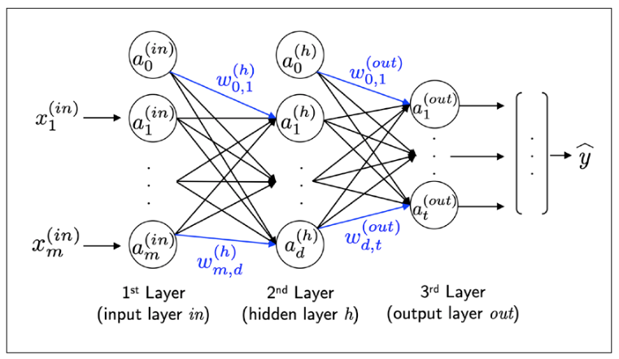
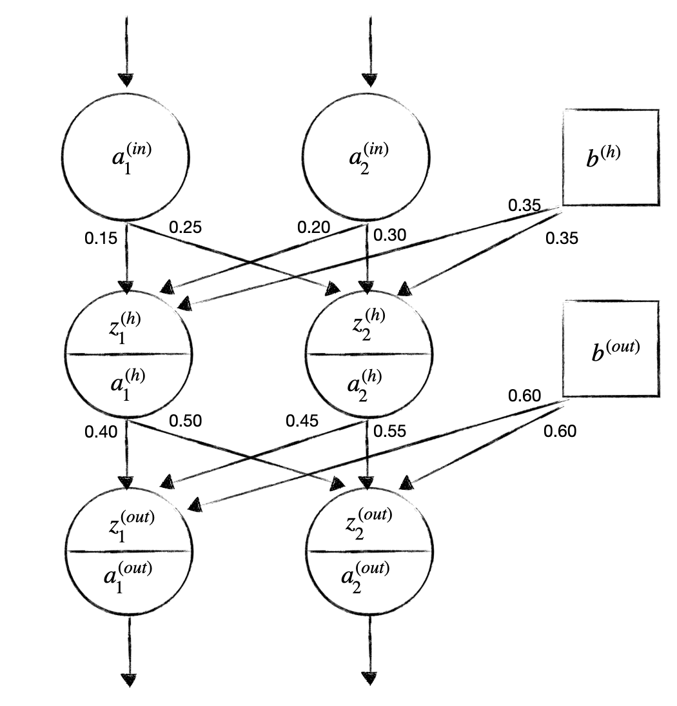

[`Computación Flexible`](../README.md) > `2. Redes Neuronales Artificiales - Backprogation`

# Redes Neuronales Artificiales - Backpropagation

**Contenido.**

- [Unidad 2. Redes Neuronales Artificiales - Backpropagation](#unidad-2-redes-neuronales-artificiales---backpropagation)
  - [Introducción](#introducción)
    - [Redes Neuronales Múlticapa (M-L NNs)](#redes-neuronales-múlticapa-m-l-nns)
  - [1. Funciones de error](#1-funciones-de-error)
  - [2. Backpropagation](#2-backpropagation)
  - [3. Algoritmos de retropagación modificados](#3-algoritmos-de-retropagación-modificados)
    - [Regularización](#regularización)
    - [Implementación de scikit-learn](#implementación-de-scikit-learn)

**Objetivo.**

En esta clase el alumno conocerá:

* La estructura básica del MLP.
* Las funciones de activación que pueden ser utilizadas en una neurona.
* El algoritmo Feedforward
* El algoritmo de Backpropagtion (online y batch)

## Introducción

Después de Madaline I, en 1971 se presentó la primera mejora significativa de las RNs feedforward. Werbos desarrollo el algoritmo de entrenamiento backpropagation, el cual fue publicada por primera vez en su tesis doctoral en 1974. La idea de la retropagación del error a través de sistemas no lineales existió siglos antes de que Werbos lo aplicara a las RNAs. Lamentablemente, el trabajo de Werbos paso desapercibido en la comunidad científica. Hasta que en 1982, Parker redescubrió la técnica y en 1985, publicó un reporte para el MIT.

En (Rumelhart & et al., 1986) redescubrieron y popularizaron el algoritmo de Backpropagation para entrenar NNs más eficientemente.

Las RNs están compuestas de varias capas, y han tenido un papel principal en los algoritmos de aprendizaje profundo y sus arquitecturas. Ejemplos comunes son los productos desarrollados por Facebook, Microsoft, Amazon, Uber y Google que han invertido demasiado en investigaciones sobre NNs y Deep Learning.

### Redes Neuronales Múlticapa (M-L NNs)

Las Redes Neuronales Múlticapa (MLP, MulitiLayer Perceptron) representada en la siguiente imagen tiene una capa de entrada, una capa oculta y una capa de salida. Las unidades en la capa oculta están completamente conectada a la capa de entrada y a la capa de salida. Si una red tiene más de una capa oculta es llamada Red Neuronal Artificial Profunda (Deep ANNs).

Mientras una unidad en la capa de salida puede ser suficiente para una tarea de clasificación binaria, es más común la forma de NN como la figura anterior, para realizar clasificación multiclase a través de la generalización de la técnica one-versus-all (OvA). La representación one-hot debe ser utilizada (como en variables categóricas).

¿Cómo se calcua la salida de un MLP?

El proceso de propagación **forward** o **feed forward** permite calcular la salida de un modelo MLP.

Algoritmo ***feedforward***

1. Activación de la capa de entrada: $a_i^{(in)} = x_i$

2. Activación de la capa oculta
  
    2.1. Cálculo de la entrada a la neurona $z_j^{(h)}  = \sum_{i} a_i^{(in)}w_{i,j}$

    2.2. Cálculo de la activación: $a_j^{(h)} = \phi\big(z_j^{(h)}\big)$

  * Si hay más de una capa oculta, se repiten los mismos pasos para cada capa oculta, sustiyendo $a_i^{(in)}$ por $a_i^{(h-1)}$
3. Activación de la capa de salida
     
     2.1. Cálculo de la entrada a la neurona $z_k^{(out)}  = \sum_{j} a_j^{(h)}w_{j,k}$
     
     2.2. Cálculo de la activación: $a_k^{(out)} = \phi\big(z_k^{(out)}\big)$

Ejemplo 1. Para el siguiente MLP

Considerar el siguiente ejemplo de entrenamiento:

|$x_1$|$x_2$|$t_1$|$t_2$|
|-----|-----|-----|-----|
|0.05 |0.1  |0.01 |0.99 |

y que todas las neuronas tanto de la capa oculta como de salida, tienen una función de activación sigmoide.

[Solución Ejemplo 1]()

## 1. Funciones de error

Las Redes Neuronales Multicapa utilizan distintas funciones de costo dependiendo del tipo de problema a resolver:

La función de Error Cuadrático Medio (MSE, Mean Square Error) es utilizada en problemas de regresión:

$J(w) = \frac{1}{2} \Sigma_{i=0}^m (target_i - a_i^{(out))})^2$

La función de costo del Promedio de Entropia Cruzada (BCE, Binary Cross-Entropy) es utilizada en casos de una clasificación binaria:

$J(w) = - \Sigma_{i=1}^n y^{[i]}\cdot log(a^{[i]}) + (1 -y^{[i]}) \cdot log(1-a^{[i]})$

Existe una función de costo para multiples clases se utiliza (CCE, Categorical Cross-Entropy)

$J(w) = - \Sigma_{i=1}^{c} t_i \cdot log(a^{[i]})$

Ejemplo 2. Calculo del error de la red

Calcular el error de la red para el Ejercicio 1. mediante la función de error MSE.

[Solución Ejercicio 2]()

## 2. Backpropagation

Tipos de entrenamientos:

* [`Ejemplo Online`](./code/brackpropagation_online.ipynb)
* [`Ejemplo Minibatch`](./code/MLP_batch_own.ipynb)
* [`Ejemplo Bach Keras`](./code/MLP_Keras.ipynb)

## 3. Algoritmos de retropagación modificados

### Regularización

EL término de regularización permite reducir el grado de overfitting, el término de regularización L2 es definido como (no regularizan las unidades bias):

$L2= \lambda||w||^2_2 = \lambda \Sigma_{j=1}^m w_j^2$

Mediante la agregación del término de regularización la función de costo logística se obtiene la siguiente ecuación:

$J(w) = - \Sigma_{i=1}^n y^{[i]} \cdot log(a^{[i]}) + (1 -y^{[i]}) \cdot log(1-a^{[i]}) +  \lambda \Sigma_{j=1}^m wj^2$

### Implementación de scikit-learn

* [`Ejemplo MLP Scikit-Learn`](./code/mlp_sklrn_bcancer.ipynb)
* [`Kfold`](./code/01_cross_validation.ipynb)

[`Anterior`](../L02-1_perceptron/README.md) | [`Siguiente`](../L02-3_SOM/README.md)
