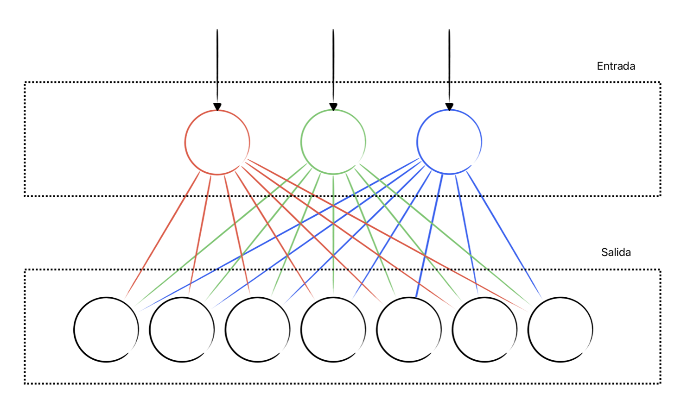
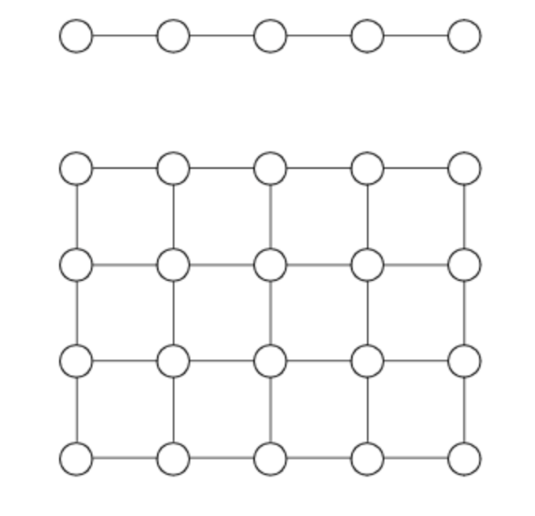

[`Computación Flexible`](../README.md) > `Unidad 5. Red de Kohonen`

## Unidad 5. Red de Kohonen

### Objetivo

En esta clase el alumno conocerá:

* Introducción al aprendizaje no supervisado
* La estructura básica SOM.
* El algoritmo entrenamiento de una red unidimensional de Khonen
* Visualización de clústers
  
### 1. Introducción 

#### Aprendizaje no supervizado

El aprendizaje supervisado elimina al maestro y requiere que el alumno forme y evalué los conceptos por su cuenta. Los científicos son quizá el mejor ejemplo de aprendizaje no supervisado en humanos. Los científicos no tienen el beneficio de un maestro. En su lugar, ellos proponen hipótesis para explicar sus observaciones, evalúan sus hipótesis utilizando criterios como la simplicidad, la generalización y la elegancia; y prueban sus hipótesis a través de experimentos de su propio diseño.

El agrupamiento  (o análisis de grupos)  es una técnica que nos permite encontrar grupos de objetos similares que esta más relacionados uno con otros que con otros del grupo. Ejemplos de aplicaciones de agrupamiento orientadas al negocio incluyen el agrupamiento de documentos, música y películas de diferentes temas, o encontrar clientes que tienen intereses similares basados en comportamiento de compras comunes com una base de un motor de recomendaciones.

#### k-means

Un ejemplo de aprendizaje no supervisado es el algoritmo k-means

K-medias o *K-Means* es un algoritmo de agrupación basada en prototipos lo que significa que utiliza prototipos (***centroides***) para representan a un grupo de objetos. 

__Algoritmo de k-means__

1. Elegir de manera aleatoria $k$ centroides de los ejemplos como centros de clusters iniciales.
2. Asignar a cada ejemplo al centroide más cercano, $\mu^{(j)}, j \in \{1, \ldots k\}$.
3. Mover el centroide al centro de los ejemplos que fueron asignados a él.
4. Repetir pasos 2 y 3 hasta que la asignación del clúster no cambie o el usuario defina una tolerancia o un número mínimo de iteraciones es alcazado.

[`Ejemplo K-means en Scikit-Learn con Iris`](./code/k_means_sklrn_iris.ipynb)

### 2. Mapas Auto-Organizativos

* Las Redes de Kohonen o knet (SOM, por las siglas en inglés de Self-Organization Map) es un tipo de red no supervisada.

* Están basadas en un aprendizaje competitivo, es decir, que las neuronas compiten entre ellas para ser activadas o encendidas. La neurona que gana la salida es llamada _winner-taker-all-neurons_ o _winning neuron_ (neurona ganadora).

#### Estructura básica de SOM

La estructura de SOM solo contiene una capa de entrada de neuronas y una capa de neuronas de salida. No hay capaz ocultas. Por lo tanto, existen dos espacio en los cuales trabaja el SOM:

- El espacio de **entrada $N$ dimensional** y
- La **cuadrícula de $G$ dimensiones** en la cual las neuronas se encuentran e indica las relaciones del vecindad entre las neuronas y, por lo tanto, la topología de la red $h_{j,i}$.

<div>

<div/>

En cuanto a la cuadrícula de la capa de salida $G$ las dimensiones más comunes son:

- En una cuadrícula de una dimensión las neuronas tiene dos vecinos (excepto para la neurona del inicio y la del final) representado como un arreglo unidimensional.

- En una cuadrícula de dos dimensiones será una arreglo cuadrado de neuronas.

<div>

<div style="text-align: justify;"/>

Otras tipologías con más dimensiones son posibles, por cuestiones de visualización no son presentadas y tampoco son muy empleadas.

La SOM se presenta como  un proceso que implica:  

1. __Competencia__. Las neuronas calculan un valor de una función discriminante. La neurona con la cantidad de mejor valor discriminante gana. 
2. __Cooperación__. La neurona ganadora determina la localización espacial de una topología de vecinos de neuronas excitadas
3. __Adaptación sináptica__. Las neuronas excitadas incrementa sus valores individuales de la función de discriminación en relación con el patrón de entrada a través de los pesos sinápticos. 

#### Competencia SOM

SOM siempre activa la neurona con la distancia más cercana al patrón de entrada.

La entrada a SOM es presentada a la RN a través de las neuronas de entrada. Las neuronas reciben un patrón (valores reales) de la capa de entrada. Un SOM requiere que las entradas estén normalizadas entre -1 y 1. Al presentar un patrón a la red se genera una reacción de las neuronas de salida.

1. **Entrada** de un valor arbitrario Entrada: $x = [x_1, x_2, \ldots, x_m]$ de la entrada del espacio $R^N$.
2. **Calculo de la distancia** entre cada neurona $j : w_j = [w_{j1}, w_{j2}, \ldots, w_{jm}]$ donde $j= 1, 2, \ldots, l$ donde $l$ es el número de neuronas en la red y $x$ mediante el cálculo de $||x-w_j||$.
3. **Una neurona se activa**, nombrada como neurona $i(x)$ con la menor distancia calculada a la entrada. Todas las otras neuronas se mantienen inactivas. Este paradigma de actividad es también llamado _winner-takes-all scheme_. 


### 3. Entrenamiento de la Red de Kohonen

El proceso de cooperación y adaptación sináptica, se puede decir que se engloban en el entrenamiento de la SOM. Después de que un patrón es presentado en la entrada y se determina la neurona ganadora. 

#### Cooperación

Como se mencionó anteriormente, la neurona ganadora determina que neuronas ajustarán sus pesos sinápticos hacia el patrón actualmente presentado. Dado que las neuronas son interconectadas por relaciones vecinales (topología $G$). El entrenamiento de la red esta altamente influido por la función de topología $h_{j,i(x)}(n)$, donde $i(x)$ es la $i$-nésima neurona ganadora, $j$ es la neurona a ser adaptada y $n$ el paso del tiempo.

Por ejemplo, para una SOM unidimensional la función de vecindad que se podría proponer, es la siguiente:

```math
h_{j,i(x)}=
\begin{cases}
1 & k \text{ vecino directo de }i ,\\ 1 & k=i,\\
0& \text{de otro modo}
\end{cases}
```

En este propuesta de $h_{j,i(x)}$ solo la neurona ganadora $i(x)$ y las las dos neuronas vecinas directas de $i(x)$ son seleccionadas para ser adapatadas al patrón de entrada. Nótese que en esta caso no se considera $n$ que es el tiempo.

Una buena elección de $h_{i,j}$ es la función Gaussiana: $h_{i,j(x)}(n)= exp \big( -\frac{d_{j,i}^2}{2 \sigma^2(n)} \big), n = 0, 1, 2, \ldots,$

donde:
1. $d_{j,i}^2 = ||r_j - r_i||^2$ el vector discreto $r_j$ define la posición de la neurona excitada $j$ y $r_i$ define la posición de la neurona ganadora $i$. Ambas son medias en un espacio de salida discreto. En el caso de un cuadrícula unidimensional, $d_{j,i}$, es un valor entero igual a $|j-i|$.
2.  $\sigma(n) = \sigma_0 \, exp \big( - \frac{n}{\tau_1}\big)$ $n= 0, 1, 2, \ldots,$ donde $\sigma_0$ es el valor de $\sigma$ al inicio del algoritmo SOM y $\tau_1$ es una constante de tiempo a ser elegida por el diseñador. 

#### Adaptación de pesos sinápticos

Una vez que se han identificado las nueronas que serán adaptadas junto con la neurona ganadora $i(x)$, los centros de las neuronas se desplazan dentro del espacio de entrada según la regla: 
$w_j(n+1) = w_j(n) + \Delta w_j(n)$

$\Delta w_j(n) = \eta(n) h_{j,i(x)}(n) (x(n) - w_j(n))$ 

donde el valor $\Delta w_j$ es simplemente agregado al centro. El último factor muestra que el cambio en la posición de las neuronas $j$ es proporcional a la distancia para el patrón de entrada $x$ y, como es usual, a una taza de aprendizaje dependiente del tiempo $\eta(t)$. 

El parámetro $\eta(n)$ debe variar en el tiempo, comenzando en $\eta_0$ e incrementando en el tiempo $n$:
$\eta(n) = \eta_0 exp \big( - \frac{n}{\tau_2} \big)$
donde $\tau_2$ es otra constante de tiempo para el algoritmo SOM. 

[`SOM unidimensional paso a paso`](./code/som_unidimensional.ipynb)

#### Algoritmo de entrenamiento

1. Inicializar pesos $w_j$ aleotorios cercanos cero 
2. Hacer para cada $x$ en $X$ 
    - Presentar $x$ normalizado
    - Obtener neurona ganadora $i(x)$
    - Mediante $h_{j,i(x)}(n)$ determinar nueronas excitadas
    - Determinar $\Delta w_j(n)= \eta(n) h_{j,i(x)}(n) (x(n) - w_j(n))$
    - Actualizar pesos $w_j(n+1) = w_j(n) + \Delta w_j(n)$
3. Repetir paso 2 hasta alcanzar criterio de parada

### 4. Visualización de clústers

#### Entrenamiento de una SOM de dos dimensiones


[`Anterior`](../L04-backpropagation/README.md) | [`Siguiente`](../L06-fuzzy-logic/README.md)