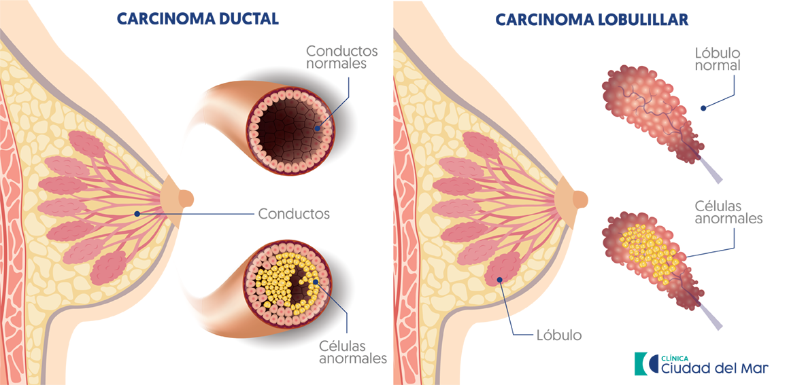
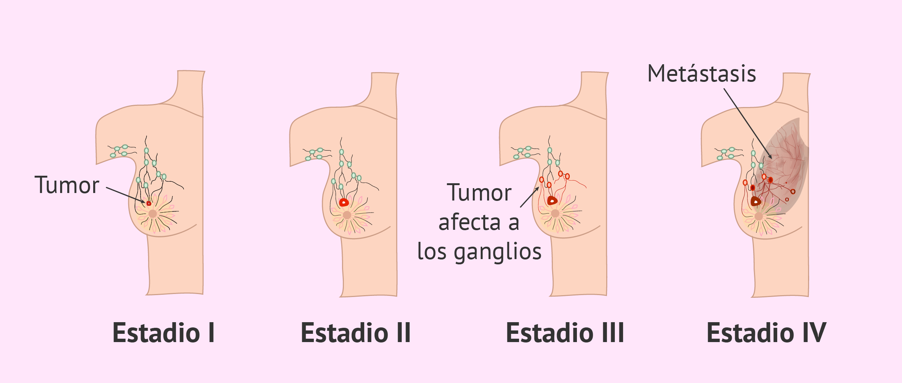

# Wisconsin Diagnostic Breast Cancer (WDBC)

El cáncer de mama es el crecimiento descontrolado de las células mamarias. Las células pueden generar tumores que pueden ser benignos o malignos. Los tumores benignos no son considerados cancerosos, pues sus células tienen una apariencia casi normal, crecen lentamente, no invaden tejidos próximos ni se propagan hacia otras partes del cuerpo. Los tumores cancerosos cumplen con todas estas características. De no ser controlados, pueden propagarse a otras partes del cuerpo. 

El cáncer de mama tiene origen en las células de los lobulillos, que son las glándulas productoras de leche, o el los conductos, donde se treasporta la leche desde los lobulillos hasta el pezón. También puede originarse en tejidos conjuntivos grasos y fibrosos de la mama, aunque con menor frecuencia.

Con el paso del tiempo, las células cancerígenas pueden invadir el tejido mamario circundante y alcanzar los glanglios linfáticos. Una vez allí, el cáncer obtiene una puerta de acceso hacia otras partes del cuerpo.

Este set de datos está compuesto de 699 ejemplos de los cuales 458 (65.5%) pertenecen a la clase "benigna" y 241(35.5%) a la clase "maligna". Cada ejemplo contiene 9 características citológicas de células mamarias, los cuales son:
- __Clump Thickness (Espesor de grupo):__ Indica que existe un agrupamiento de células cancerígenas en varios niveles.
- __Uniformity of cell size (Uniformidad del tamaño de la célula):__ Indica si los ganglios linfáticos contienen metástasis.
- __Uniformity of cell shapes (Uniformidad de la forma de la célula):__ Identifica células cancerígenas de tamaños variados.
- __Marginal adhesion (Adherencia marginal):__ Indica si las células presentan pérdida de Adhesión. Si la célula pierde esta propiedad se le considera un indicación de que es maligna.
- __Single epithelial cell size (Tamaño de célula epitelial):__ Si es muy grande, la célula puede ser maligna.
- __Bare nuclei (Nucleo sin citoplasma):__ Es encontrado en tumores benignos.
- __Bland chromatin (Cromatina blanda):__ Es encontrado en células benignas.
- __Normal nucleoli (Nucleoleo normal):__ En las células benignas es generalmente muy pequeño.
- __Mitoses (Mitosis):__ El proceso en el cual las células se dividen.

Creadores:

- O. L. Mangasarian and W. H. Wolberg: "Cancer diagnosis via linear programming", SIAM News, Volume 23, Number 5, September 1990, pp 1 & 18.
- William H. Wolberg and O.L. Mangasarian: "Multisurface method of pattern separation for medical diagnosis applied to breast cytology", Proceedings of the National Academy of Sciences, U.S.A., Volume 87, December 1990, pp 9193-9196.
- O. L. Mangasarian, R. Setiono, and W.H. Wolberg: "Pattern recognition via linear programming: Theory and application to medical diagnosis", in: "Large-scale numerical optimization", Thomas F. Coleman and Yuying Li, editors, SIAM Publications, Philadelphia 1990, pp 22-30.
- K. P. Bennett & O. L. Mangasarian: "Robust linear programming discrimination of two linearly inseparable sets", Optimization Methods and Software 1, 1992, 23-34 (Gordon & Breach Science Publishers).